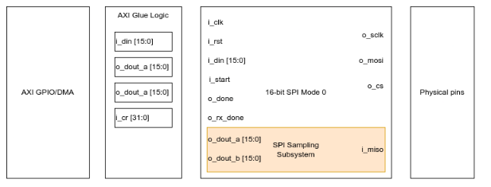
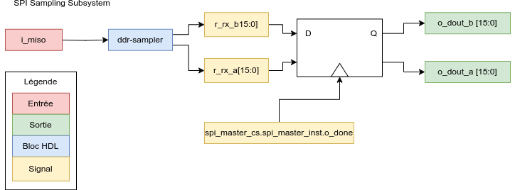

# FPGA RHD2164 SPI

## Introduction

This repo is an implementation of a custom SPI driver that allows an FPGA to interact with RHD2164, including the DDR mode during sampling.

## System Overview

### SPI

The figure below shows the conceptual overview of the system. Since SPI is widely available as a normal peripheral, this implementation is not flexible enough to be used as a general-purpose SPI. With Xilinx FPGAs, an AXI interface should be used to expose the RHD SPI, located in the Programmable Logic (PL), to the Processing System (PS). Among others, this allows PYNQ to access it as a memory-mapped peripheral.

Make sure the CS Inactive time is long enough, which is adjustable with the CLKS_PER_HALF_BIT parameter in `hdl/spi_master_cs.v`.

The module is interacted with like so:

1. Write some data to `i_din`, which will be sent via the MOSI line when the transfer starts
2. Toggle `i_start`. Setting it to 1 will start the transfer, so you should reset it eventually to not keep transferring stuff
3. Wait until `o_done` goes high, which indicates that the SPI transfer is finished (both RX and TX)
4. Read data
	- **Non-convert command**: Read `o_dout_a`, which contains the data received on MISO. 
	- **Convert command**: Read `o_dout_a`, which contains MISO A data (eg channels 0-31). Read `o_dout_b`, which contains MISO B data (eg channels 32-63).

The SPI sampling subsystem is a little bit trickier to implement, since Intan's RHD2164 CONVERT command has a very weird sampling pattern. Consequently, the SPI data reception is split into two branches, which are selectively chosen depending on the `i_din[15]` and `i_din[14]` bits. The figure below illustrates the block design. `DOUT_B[0]` from `spi_master` always returns 0, since it is sampled at `CS`'s rising edge. Thus, it is `spi_master_cs`'s responsibility to set the bit appropriately.  

### AXI

In Xilinx PS-PL applications, AXI can be used to bridge the PS and the PL by memory-mapping HDL ports. As such, this design provides an AXI Block Design to easily access the SPI module within a PS environment. Refer to [Xilinx Development](#xilinx-development). 

## HDL development setup

Personally, I'd recommend developing the HDL code and testbench in a nice IDE like VS Code. Custom HDL sources are located in `hdl/`.

This project uses the [cocotb](https://docs.cocotb.org/en/stable/) Python library to write the testbench, which is located under `sim/`. Refer to cocotb's documentation to know how to set it up and use it. The current `Makefile` uses [Icarus Verilog](https://github.com/steveicarus/iverilog) as simulator.

To install Icarus Verilog on Ubuntu, run `sudo apt-get update && sudo apt-get install iverilog -y`

**Passing testbench tests do not ensure the design will work post-synthesis, let alone synthesize.**

## Xilinx development setup

### Vivado

The original Vivado version used is 2022.1, so the project may very well break if another version is used.

To get started quickly, open Vivado and create a new project with your target board. Then, add the sources located in `source/` to the project.

Generate the block design: `Tools -> Run tcl script -> <path-to-project>/vivado/axi-rhd-spi.tcl`. The block design should get generated. Make sure the _Zynq Processing System_ is configured correctly for your board. Then, create an _HDL Wrapper_ over the Block Design and set it as _Top Level_.

You should now be ready to develop (you should still follow the [development setup](#hdl-development-setup)), simulate, generate the bitstream, etc.

#### Zybo Z7-20

If you have a Zybo Z7-20 board and want to skip the Vivado project creation, you may use the precompiled artifacts located under `vivado`:

- `rhd-spi_wrapper_zybo_z720.bit` 
- `rhd-spi_wrapper_zybo_z720.xsa` 
- `rhd-spi_zybo_z720.xdc` 

### Vitis

Vitis is used to create the Processing System-side application, which may or may not communicate with the PL.

To use Vitis, just follow any well-made Vitis tutorial, such as [Digilent's](https://digilent.com/reference/programmable-logic/guides/getting-started-with-ipi).

Some more varied and advanced Vitis tutorials are available on Xilinx's [Vitis-Tutorials repo](https://github.com/Xilinx/Vitis-Tutorials).

A working barebones demo is located at `vitis/main.c`. To use it, just create a `Hello World` application in Vitis, and copy-paste the contents of `main.c` into the newly created main file. The payload starts at `0x0000` and increments by 1 after every packet.

## [TODO] PYNQ development setup

## References

- SPI [tutorial](https://www.analog.com/en/analog-dialogue/articles/introduction-to-spi-interface.html)
- RHD2164 [datasheet](https://intantech.com/files/Intan_RHD2164_datasheet.pdf)
- Verilog [tutorial](https://www.chipverify.com/tutorials/verilog)
- [Verilator](https://verilator.org/guide/latest/index.html), a Verilog/SystemVerilog compiler to C++/SystemC
- [cocotb](https://docs.cocotb.org/en/stable/index.html), a python library to build SystemVerilog and Verilog testbenches
- Nandland's SPI driver [source](https://github.com/nandland/spi-master)
